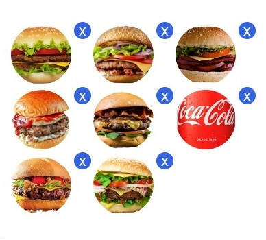

# Preview-Img
## Lib de preview de imagem carregada em input file
<p>Fala programador(a), beleza? </p>
<p>Sempre que inserimos uma imagem em um form, só é exibido o nome dela e sua extensão </p>
<p>&nbsp &nbsp &nbsp &nbsp O que pode gerar dúvida no usuário, se ele inseriu a imagem correta?</p>
<p> Por isso o <strong>Preview-Img</strong> é excelente, podemos inserir uma pré-visualização antes de enviar para o servidor</p>

### Baixe este repositório e faça um teste!
- git clone https://github.com/paulorafaeljobs/Preview-Img

### <a href='https://paulorafaeljobs.github.io/Preview-Img'>Link Demonstração</a>



<p>Código de exemplo:</p>

```html
<link rel="stylesheet" href="PreviewUpload.css">
<form action=" " enctype="multipart/form-data" method="POST">
    <div class="flexbox">
        <p id="fotodacapa" style="line-height: 70px;margin-right: 10px;">Imagem</p>
        
        <input style=" display:none;" type="file" name="img1" id="flImage1">
        <button class="buttonX" id="ButtonX1">X</button>
        
        
        <input style=" display:none;" type="file" name="img2" id="flImage2">
        <button class="buttonX" id="ButtonX2">X</button>

        
        <input style=" display:none;" type="file" name="img3" id="flImage3">
        <button class="buttonX" id="ButtonX3">X</button>

        
        <input style=" display:none;" type="file" name="img4" id="flImage4">
        <button class="buttonX" id="ButtonX4">X</button>

        
        <input style=" display:none;" type="file" name="img5" id="flImage5">
        <button class="buttonX" id="ButtonX5">X</button>

        
        <input style=" display:none;" type="file" name="img6" id="flImage6">
        <button class="buttonX" id="ButtonX6">X</button>

        
        <input style=" display:none;" type="file" name="img7" id="flImage7">
        <button class="buttonX" id="ButtonX7">X</button>

        
        <input style=" display:none;" type="file" name="img8" id="flImage8">
        <button class="buttonX" id="ButtonX8">X</button>
    </div>
</form>
<script src="PreviewUpload.js"></script>
```

## Contato:
<p>paulo.rafael.jobs@gmail.com</p>
<p><a href='https://paulorafaelweb.herokuapp.com/'>https://paulorafaelweb.herokuapp.com/</a> </p>